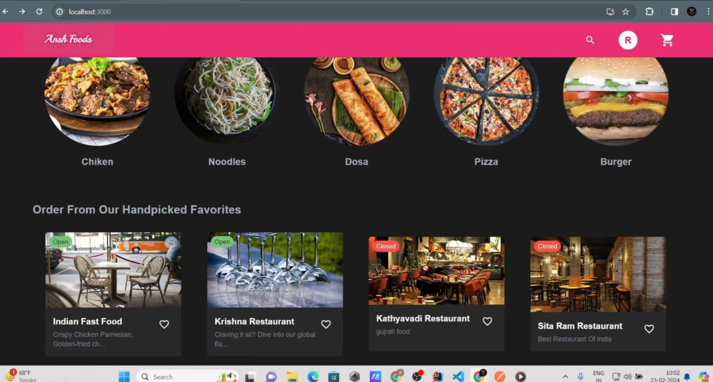
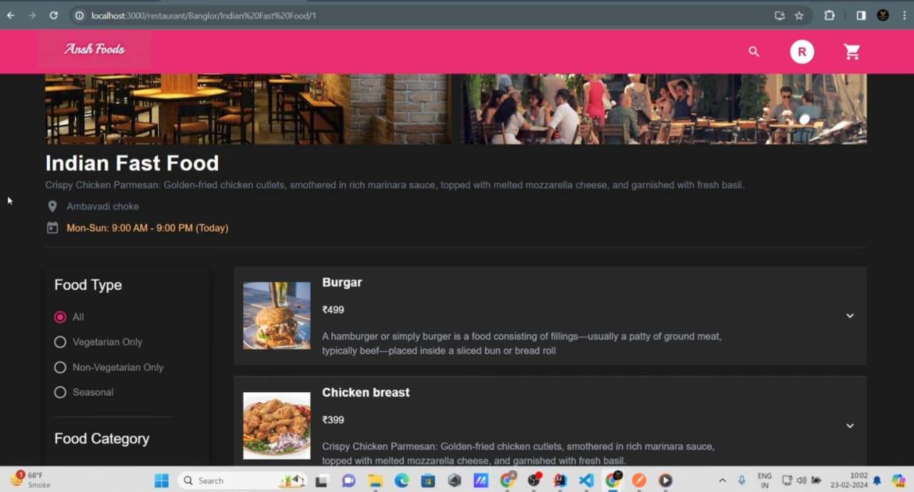
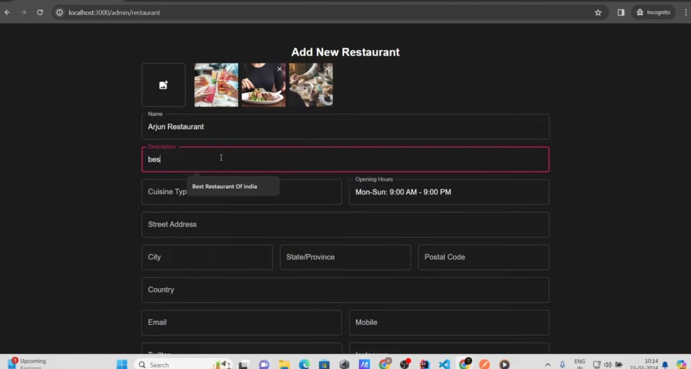
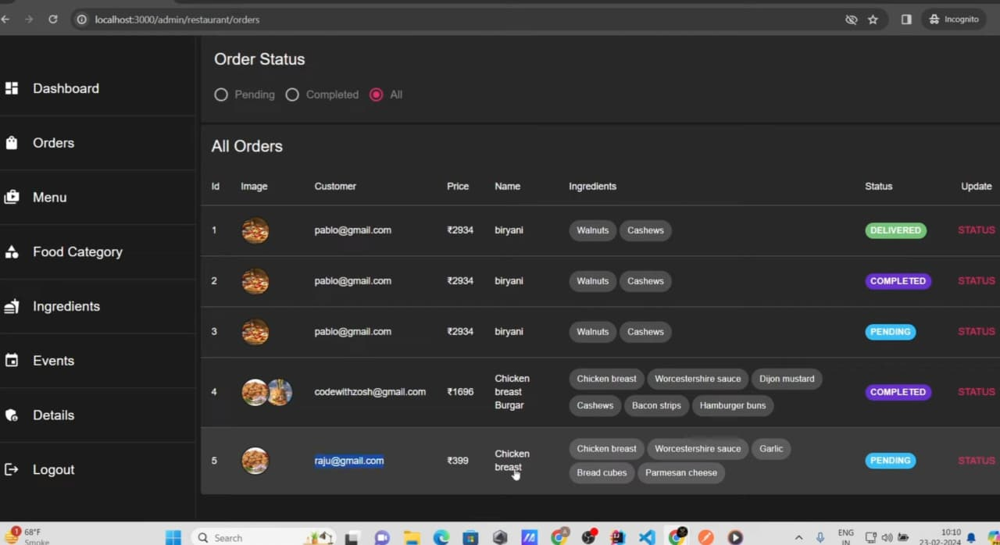
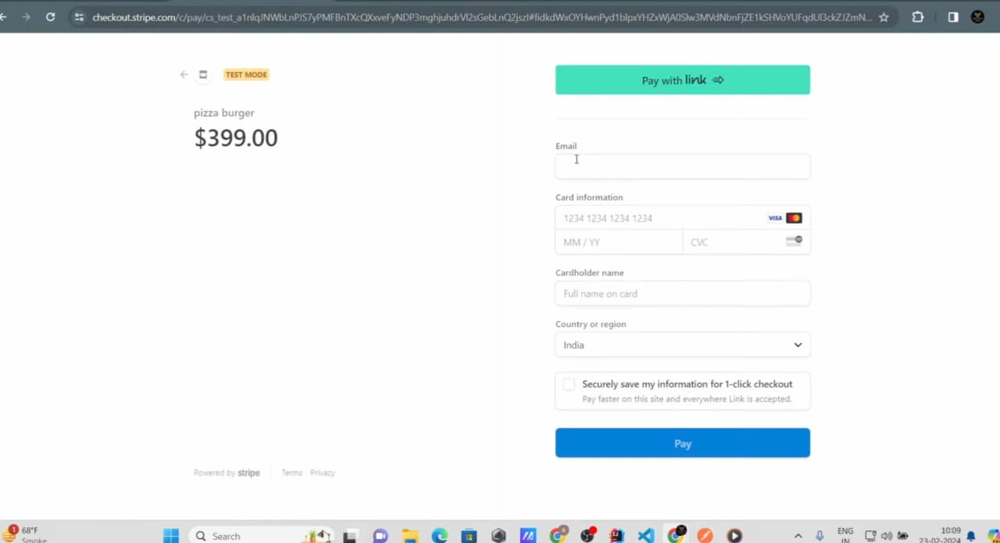

# 🍔 Multi-Vendor Food Ordering Platform

A full-stack **multi-vendor food ordering platform** where restaurant owners can register their restaurants, manage food items and categories, while customers can browse restaurants, save their favourite foods, place orders, and make secure online payments.

The application provides separate functionality for **customers** and **restaurant owners**, with authentication, password recovery, restaurant and food management, ordering, and Stripe payment integration.

## 🚀 Features

### 👤 Customer

* Register and log in as a customer
* Browse restaurants registered on the platform
* View restaurant menus and food categories
* Browse available food items
* Add food items to favourites
* Place food orders
* Make payments using **Stripe**
* View and manage orders
* Forgot password functionality through email

### 🏪 Restaurant Owner

* Register and log in as a restaurant owner
* Create and manage a restaurant
* Add and manage food items
* Organize food items into different categories
* Update food information
* Manage restaurant-specific menu items
* Receive and manage customer orders

### 🔐 Authentication & Security

* JWT-based authentication
* Role-based access for customers and restaurant owners
* Secure password handling
* Forgot password / password reset functionality
* Email integration using **Spring Starter Mail**

### 💳 Payments

* Integrated **Stripe Payment Gateway**
* Secure online payment processing
* Payment flow integrated with the food ordering process

## 🛠️ Tech Stack

### Backend

* **Java**
* **Spring Boot**
* **Spring MVC**
* **Spring Data JPA**
* **Hibernate**
* **MySQL**
* **JWT**
* **Spring Starter Mail**

### Frontend

* **React**
* **Tailwind CSS**
* **Axios**

### Payment

* **Stripe**

## 🏗️ Application Architecture

The application follows a client-server architecture:

```text
                    ┌─────────────────────┐
                    │       React         │
                    │   + Tailwind CSS    │
                    └──────────┬──────────┘
                               │
                         HTTP / REST API
                               │
                               ▼
                    ┌─────────────────────┐
                    │     Spring Boot     │
                    │     Spring MVC      │
                    │                     │
                    │ Authentication      │
                    │ Business Logic       │
                    │ REST Controllers     │
                    └──────────┬──────────┘
                               │
                         JPA / Hibernate
                               │
                               ▼
                    ┌─────────────────────┐
                    │       MySQL         │
                    │    Relational DB    │
                    └─────────────────────┘

                               │
                               ▼
                    ┌─────────────────────┐
                    │       Stripe        │
                    │ Payment Processing  │
                    └─────────────────────┘
```

The React frontend communicates with the Spring Boot backend through REST APIs using **Axios**. Spring Data JPA and Hibernate handle persistence and communication with the MySQL database.

JWT is used to authenticate users and control access to customer and restaurant-owner functionality.

## 📸 Screenshots

### Customer Interface



### Restaurant Interface


### Food & Categories


### Ordering & Payment




## 🔑 User Roles

The application supports two primary user roles:

| Role                 | Capabilities                                                                 |
| -------------------- | ---------------------------------------------------------------------------- |
| **Customer**         | Browse restaurants, view menus, favourite foods, place orders, make payments |
| **Restaurant Owner** | Create restaurants, manage categories, add/manage foods, manage orders       |

## 📂 Project Structure

### Backend

```text
backend/
├── src/
│   ├── main/
│   │   ├── java/
│   │   │   └── ...
│   │   └── resources/
│   │       └── application.properties
│   └── test/
└── pom.xml
```

### Frontend

```text
frontend/
├── src/
│   ├── components/
│   ├── pages/
│   ├── services/
│   ├── hooks/
│   └── ...
├── public/
└── package.json
```

> The exact structure may vary depending on the current project implementation.

## ⚙️ Getting Started

### Prerequisites

Make sure the following are installed:

* Java
* Maven
* Node.js
* npm
* MySQL

You will also need a **Stripe account** for payment integration.

### 1. Clone the repository

```bash
git clone https://github.com/anshuman-borah/Ansh-Food---Food-Delivery-Application.git

cd Ansh-Food---Food-Delivery-Application
```

### 2. Configure MySQL

Create a MySQL database and configure the database connection in the Spring Boot application's configuration.

```properties
spring.datasource.url=jdbc:mysql://localhost:3306/your_database
spring.datasource.username=your_username
spring.datasource.password=your_password
```

### 3. Configure environment variables

Add the required configuration for:

* Database credentials
* JWT secret
* Email configuration
* Stripe API keys

**Do not commit secret keys or passwords to the repository.**

### 4. Start the backend

```bash
mvn spring-boot:run
```

### 5. Start the frontend

Navigate to the frontend directory and install dependencies:

```bash
npm install
```

Then start the development server:

```bash
npm run dev
```

The application should now be available through the frontend development server.

## 🔐 Password Recovery

The application includes a password recovery workflow for users who forget their password.

The backend uses **Spring Starter Mail** to send password-reset related emails.

## 💳 Stripe Integration

Stripe is integrated into the application to handle online payments during the ordering process.

The payment flow allows customers to proceed from their order to a secure Stripe payment process.

## 🔗 Links

**Live Demo:**
https://ansh-food-frontend.vercel.app/

**Source Code:**
https://github.com/anshuman-borah/Ansh-Food---Food-Delivery-Application

## 📌 Project Highlights

* Multi-vendor restaurant architecture
* Separate customer and restaurant-owner workflows
* JWT-based authentication
* RESTful backend APIs
* Relational database design with MySQL
* JPA/Hibernate-based persistence
* Restaurant and menu management
* Food categorization
* Favourite food functionality
* Order management
* Stripe payment integration
* Password recovery through email
* Responsive React interface
* Tailwind CSS styling
* Axios-based API communication

## 👨‍💻 Author

**Anshuman Borah**

* GitHub: https://github.com/anshuman-borah
* LinkedIn: https://linkedin.com/in/anshuman15
